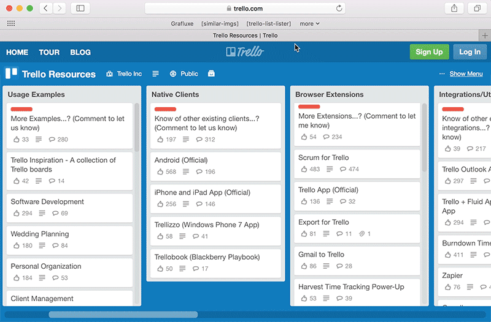

# Trello List Lister

This bookmarklet adds the ability to output lists from Trello cards. It integrates into the Trello UI and allows you to list cards easily.

The latest version is `1.0.0`

## What is a Bookmarklet

A bookmarklet is a browser bookmark that runs code. It allows developers to extend browser functionality. Learn more [here](https://en.wikipedia.org/wiki/Bookmarklet).

## Use Case

This bookmarklet can come in handy when you want to create:

- A changelog based on a Trello list.
- A commit message based on a Trello list.
- An email based on a Trello list.

## Install/Use It

Install via [Bookmarklet Installer](http://grafluxe.com/o/bmk?title=trello-list-lister&path=bit.ly%2F2rZFC59).

## How To Use

- When in a Trello board, click this bookmarklet to add a "List Cards" button to every list.
- Upon clicking the "List Cards" button, a modal will open listing every card in your selected list.

To determine the version you're running, open your dev tools and run `TrelloListLister.version`. If you're version is outdated, delete your bookmarklet and reinstall.

## Notes

- The outputted list is formatted as markdown text.
- This bookmarklet reuses many Trello styles in order to present a unified look and feel.
  - This also helps to decrease this bookmarklets footprint.
- Clicking the bookmarklet once it's open will toggle its visibility.

## License

Copyright (c) 2014, 2017 Leandro Silva (http://grafluxe.com)

Released under the MIT License.

See LICENSE.md for entire terms.
